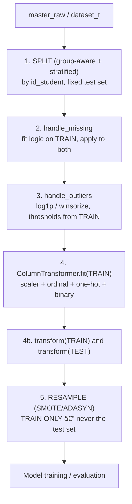

# Preprocessing Sequence: Split → Fit → Transform → Resample

*The order of operations that prevents test-set information from leaking into training*

**DSP391m – Group 5 · Report 2 (Data Tasks), Chapter 3 · Work item STT 22 (vanson)**
*Implemented in `src/features/preprocessing.py`.*

---

## 1. The core principle

Every component that **learns** from data — imputation statistics, encoders, the scaler, and any resampler — must be **fit on the training fold only** and then **applied** (transform) to the test set. Fitting on the full dataset before splitting leaks test-set statistics (means, category sets, class structure) into training and yields optimistic, non-reprovansonible estimates.

## 2. The sequence



ASCII form (for environments without Mermaid):

```
 master_raw / dataset_t
        |
 [1] SPLIT  (StratifiedGroupKFold by id_student; fixed 20% test set)
        |
 [2] handle_missing   -> impute logic learned on TRAIN, applied to TRAIN+TEST
        |
 [3] handle_outliers  -> log1p / winsorize; thresholds from TRAIN
        |
 [4] ColumnTransformer.fit(TRAIN)  -> StandardScaler + Ordinal + OneHot + Binary
        |
 [4b] transform(TRAIN), transform(TEST)
        |
 [5] RESAMPLE (SMOTE / ADASYN)  -> TRAIN ONLY
        |
 model.fit(TRAIN_resampled) ; evaluate on TEST
```


## 3. Why each step sits where it does

| Step | Anti-leakage reason |
|---|---|
| 1. Split first | Nothing is learned before the test set is separated, so no statistic can flow from test to train. |
| 2. Missing | `imd_band → "Unknown"`; assessment gaps → 0 plus the `not_submitted` flag; `date_registration` → **train** median. |
| 3. Outliers | `log1p` for right-skewed clickstream features; `winsorize` thresholds learned per fold; **no rows dropped**. |
| 4. Encode + scale | `StandardScaler`, `OrdinalEncoder`, `OneHotEncoder`, `BinaryEncoder` are **fit on train only**; `scaler.mean_` is computed from train and printed as evidence. |
| 5. Resample | SMOTE/ADASYN run **inside the training fold only**; the test set must reflect the real class distribution, so it is never resampled. |

## 4. Evidence of correctness

- `scaler.mean_` is derived solely from the training fold (printed by `fit_transform_train`).
- The test set is transformed with `.transform()` only — never `.fit()` / `.fit_transform()`.
- Resampling is applied after transforming, on `X_train` only.

This ordering is the practical embodiment of the leakage-prevention rules (STT 12) on the **feature** axis, complementing the **time** axis enforced by `cut_at_checkpoint`.

## References

8. N. V. Chawla et al., "SMOTE: Synthetic Minority Over-sampling Technique," *JAIR*, 2002.

