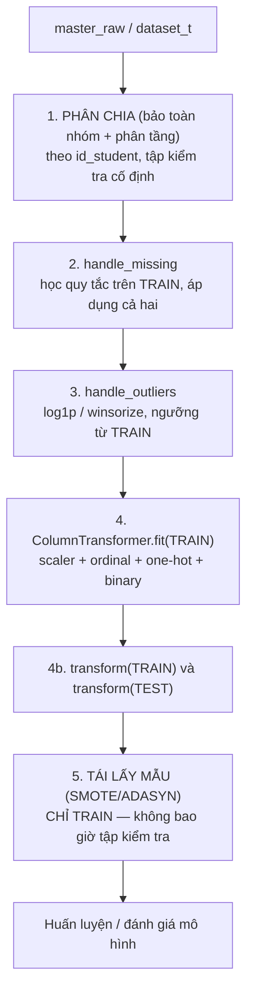
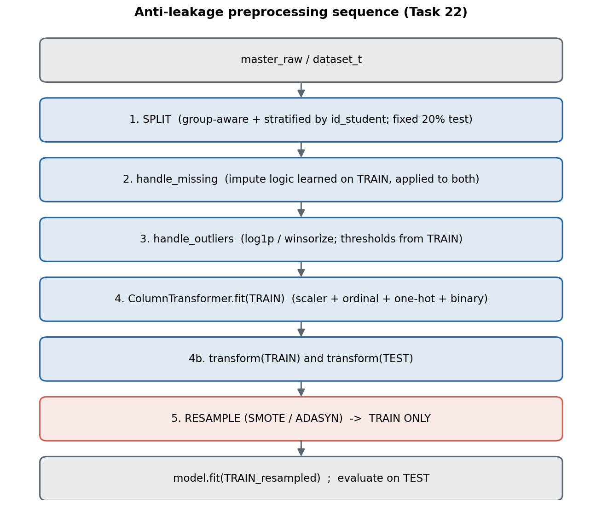

# Trình tự tiền xử lý: Phân chia → Khớp → Biến đổi → Tái lấy mẫu

*Thứ tự các bước nhằm ngăn thông tin tập kiểm tra rò rỉ sang tập huấn luyện*

**DSP391m – Nhóm 5 · Báo cáo 2 (Tác vụ dữ liệu), Chương 3 · Hạng mục STT 22 (Ngọc Sang)**
*Cài đặt trong `src/features/preprocessing.py`.*

---

## 1. Nguyên tắc cốt lõi

Mọi thành phần **học** từ dữ liệu — thống kê điền khuyết, bộ mã hoá, bộ chuẩn hoá, và bộ tái lấy mẫu — phải được **khớp chỉ trên fold huấn luyện** rồi **áp dụng** (transform) cho tập kiểm tra. Khớp trên toàn bộ dữ liệu trước khi phân chia sẽ làm rò rỉ thống kê của tập kiểm tra (trung bình, tập giá trị, cấu trúc lớp) sang tập huấn luyện và cho ước lượng lạc quan, không tái lập được.

## 2. Trình tự



Dạng ASCII (cho môi trường không hỗ trợ Mermaid):

```
 master_raw / dataset_t
        |
 [1] PHÂN CHIA  (StratifiedGroupKFold theo id_student; tập kiểm tra 20% cố định)
        |
 [2] handle_missing   -> học quy tắc điền trên TRAIN, áp dụng TRAIN+TEST
        |
 [3] handle_outliers  -> log1p / winsorize; ngưỡng từ TRAIN
        |
 [4] ColumnTransformer.fit(TRAIN)  -> StandardScaler + Ordinal + OneHot + Binary
        |
 [4b] transform(TRAIN), transform(TEST)
        |
 [5] TÁI LẤY MẪU (SMOTE / ADASYN)  -> CHỈ TRAIN
        |
 model.fit(TRAIN_đã_tái_lấy_mẫu) ; đánh giá trên TEST
```



## 3. Vì sao mỗi bước nằm ở vị trí đó

| Bước | Lý do phòng rò rỉ |
|---|---|
| 1. Phân chia trước | Không học bất cứ điều gì trước khi tách tập kiểm tra, nên không thống kê nào chảy từ test sang train. |
| 2. Khuyết | `imd_band → "Unknown"`; điểm khuyết do chưa nộp → 0 kèm cờ `not_submitted`; `date_registration` → trung vị **train**. |
| 3. Ngoại lai | `log1p` cho đặc trưng clickstream lệch phải; ngưỡng `winsorize` học theo từng fold; **không loại bỏ bản ghi**. |
| 4. Mã hoá + chuẩn hoá | `StandardScaler`, `OrdinalEncoder`, `OneHotEncoder`, `BinaryEncoder` **chỉ khớp trên train**; `scaler.mean_` tính từ train và in ra làm minh chứng. |
| 5. Tái lấy mẫu | SMOTE/ADASYN chạy **chỉ trong fold huấn luyện**; tập kiểm tra phải phản ánh phân phối lớp thực, nên không bao giờ được tái lấy mẫu. |

## 4. Minh chứng tính đúng đắn

- `scaler.mean_` chỉ suy ra từ fold huấn luyện (in bởi `fit_transform_train`).
- Tập kiểm tra chỉ được biến đổi bằng `.transform()` — không bao giờ `.fit()` / `.fit_transform()`.
- Tái lấy mẫu áp dụng sau khi biến đổi, chỉ trên `X_train`.

Trình tự này là sự hiện thực hoá các quy tắc phòng rò rỉ (STT 12) trên trục **đặc trưng**, bổ trợ cho trục **thời gian** được bảo đảm bởi `cut_at_checkpoint`.

## Tài liệu tham khảo

8. N. V. Chawla và cộng sự, "SMOTE: Synthetic Minority Over-sampling Technique," *JAIR*, 2002.
